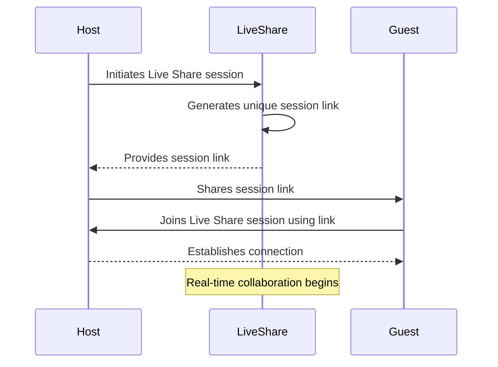
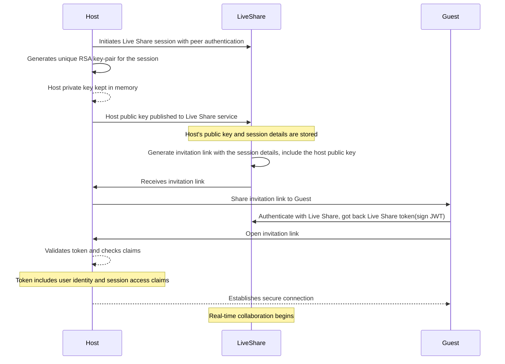

# Security of VS Code Live share

## What is VS Code Live Share?

VS Code Live Share is a collaborative development tool that enables real-time code sharing and editing among multiple developers. It allows users to work together on the same codebase, with each participant able to see and edit the code simultaneously. Live Share also supports features like debugging and terminal sharing, fostering a seamless collaborative coding experience within the Visual Studio Code editor. It's particularly useful for pair programming and remote collaboration.

## What we can see (assume) that it's happen when we using live share

However, several questions arise, such as:

- How does the Live Share server gather information to generate a unique session link?
- Is peer-to-peer connection still going to work if there are NAT or Firewall in the middle?
- What authentication method is employed between the Guest and Host during a Live Share session?
- How is the wire connection secured?

I have conducted further research on these inquiries, and let's explore them together.

## What actually happening during the Peer Authentication

1. **Host Initiates Live Share Session**:
   The Host initiates a Live Share session with peer authentication.
2. **RSA Key-Pair Generation**:
   The Host generates a unique RSA key-pair specifically for this Live Share session.
   The Host's private key is kept in memory and not written to disk for security reasons.
3. **Host Publishes Public Key**:
   The Host publishes the generated public key to the Live Share service, along with session details such as IP address or relay endpoint.
4. **LiveShare Generates Invitation Link**:
   LiveShare generates an invitation link, incorporating the session details and including the Host's public key.
5. **Host Shares Invitation Link**:
   The Host shares the invitation link, containing the Live Share session details and the public key, with the Guest.
6. **Guest Authentication with Live Share**:
   The Guest authenticates with the Live Share service, obtaining a Live Share token (signed JWT) as a result.
7. **Guest Opens Invitation Link**:
   The Guest opens the invitation link, initiating the connection process.
8. **Host Validates Token**:
   The Host validates the Live Share token received from the Guest, checking its claims, including user identity and session access permissions.
9. **Establishment of Secure Connection**:
   Upon successful validation, the Host and Guest establish a secure connection, marking the beginning of real-time collaboration through Live Share.
